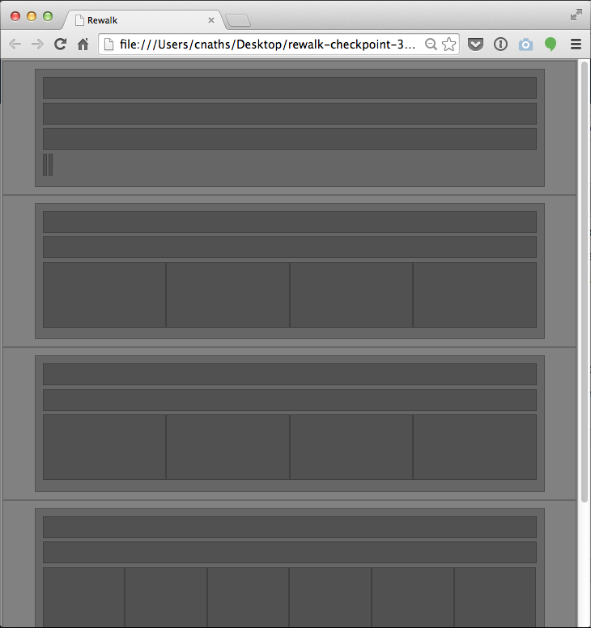

# [Lab] Rewalk – Checkpoint 3

_**Before you start, make a copy of your project folder from the previous lab; work within this new copy.**_

From the lecture notes provided, and based upon the previous lab, complete the following steps:

  1. Write the CSS for the Page Structure defined in your wireframe from the previous lab to produce an HTML/CSS version of the wireframe.

You will be producing an "empty" HTML/CSS wireframe, free of content or background images. Here is a screenshot of an example of what your finished result might look like.

## Submission Requirements

In order to submit this lab, you must complete all of the following:

  1. Upload your project folder, named "rewalk-checkpoint-3" to  a web server and submit a link through Moodle.
