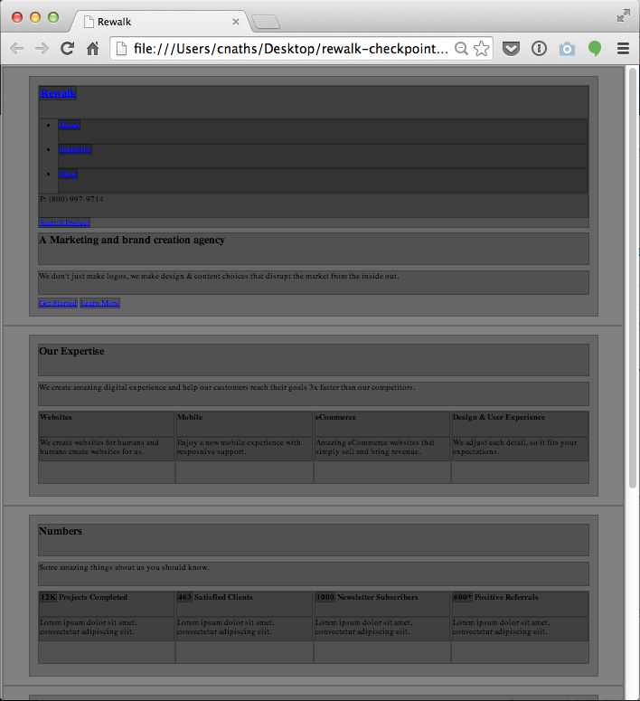

# [Lab] Rewalk – Checkpoint 4

_**Before you start, make a copy of your project folder from the previous lab; work within this new copy.**_

From the lecture notes provided, and based upon the previous lab, complete the following steps:

  1. Add the content (found in the PSD) to your HTML/CSS wireframe

You will be producing an HTML/CSS wireframe which includes the content from the design comp. The content should be left unstyled. Here is a screenshot of an example of what your finished result might look like.

##Submission Requirements

In order to submit this lab, you must complete all of the following:

  1. Upload your project folder, named "rewalk-checkpoint-4" to  a web server and submit a link through Moodle.

